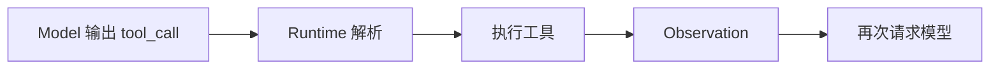

# Demo 2：Tool Calling 闭环



```ts
if (out.type === 'tool_call') {
  const tool = registry.get(out.name)
  const result = await tool.invoke(out.args)
  messages.push({ role: 'tool', content: JSON.stringify(result) })
}
```

常见错误：

- 工具参数 schema 未校验导致运行时崩溃
- 工具返回结构不稳定导致模型难以使用结果
