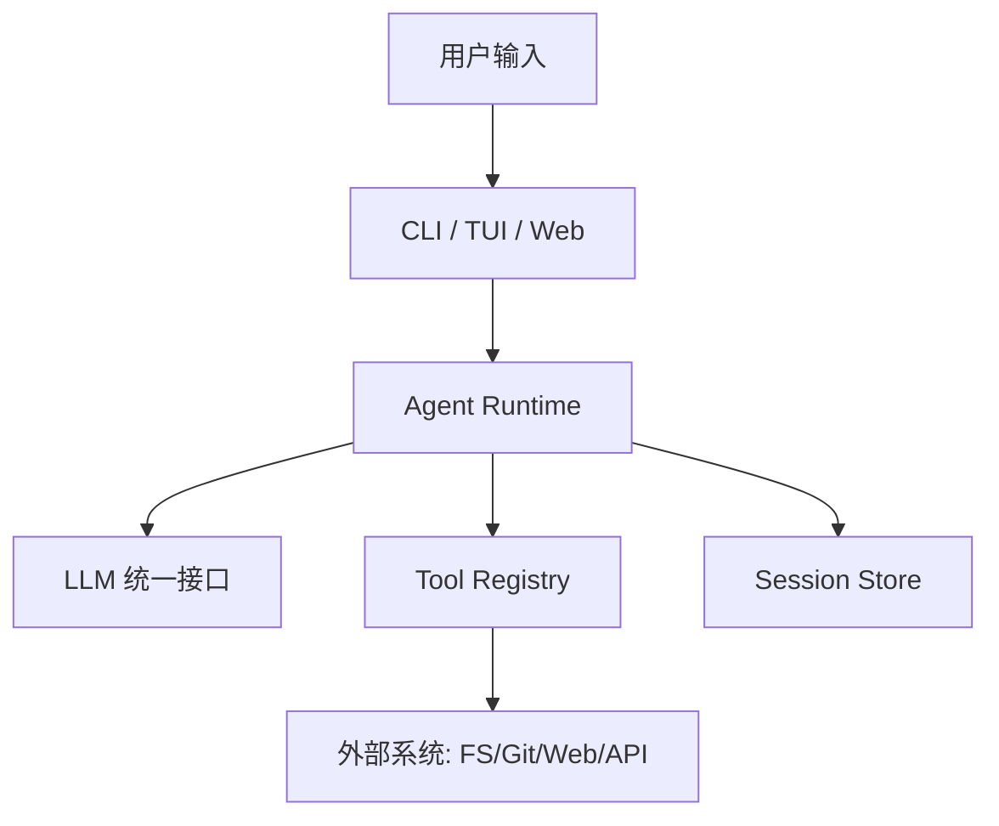
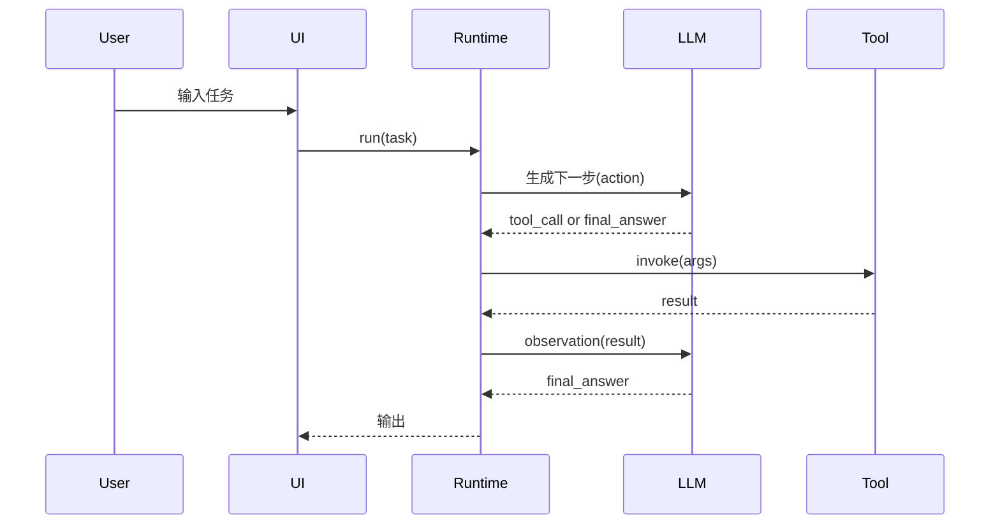

# Pi 架构总览

## 总体分层

```mermaid
flowchart TD
  U[用户输入] --> UI[CLI / TUI / Web]
  UI --> CORE[Agent Runtime]
  CORE --> LLM[LLM 统一接口]
  CORE --> TOOLS[Tool Registry]
  CORE --> SESS[Session Store]
  TOOLS --> EXT[外部系统: FS/Git/Web/API]
```

### 为什么要分层？

- **可替换性**：换模型、换 UI，不必重写核心 loop。
- **可测试性**：核心 loop 可在 mock LLM 上做 deterministic 测试。
- **可扩展性**：工具和技能是增量扩展，不侵入核心。

## 典型调用时序

```mermaid
sequenceDiagram
  participant User
  participant UI
  participant Runtime
  participant LLM
  participant Tool

  User->>UI: 输入任务
  UI->>Runtime: run(task)
  Runtime->>LLM: 生成下一步(action)
  LLM-->>Runtime: tool_call or final_answer
  Runtime->>Tool: invoke(args)
  Tool-->>Runtime: result
  Runtime->>LLM: observation(result)
  LLM-->>Runtime: final_answer
  Runtime-->>UI: 输出
```
